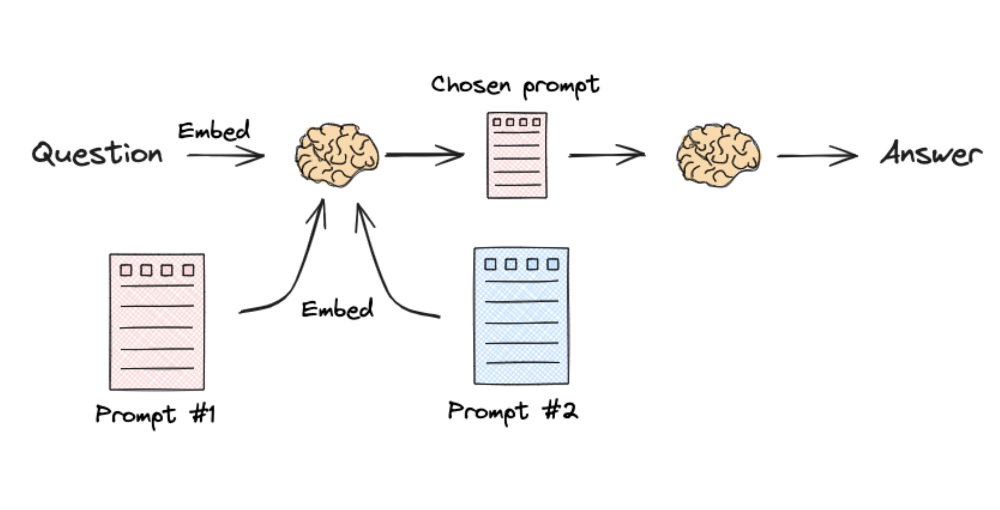

# RAGDojo
## Python Version
remember torch doesn't support python > 3.10

## Embeddings
if I use Ollama Embeddings, it runs on local machine, and it takes too long

### RAG101
Focus on **the base process of a RAG**

### RAG201 - Query Transformations: Multi Query
* Multi Query: Prompt the Model to generate more related questions based on the user question. Then use all the questions to retrives docusments from the vector store, get the unique union of all the retrived documents(remove the duplicated ones), and finally use all the documents as context


### RAG202 - Query Transformations: RAG-Fusion
**RAG-Fusion**: The Multi Query method used above will prompt the model to generate multiple question in a form of [question1, question2, question3]. When we use this array to retrive data from the retriver, we will then get the result in a form of [[doc3, doc4, doc1], [doc3, doc2, doc1], [doc2, doc4, doc5]]. Instead of simply merge the results and remove the duplicated docs, RAG-Fusion use *Reciprocal Rank Fusion* algrorithm to rerank the docs based on their relevance (assuming the retriver return to docs in sorted order of relevance).


### RAG203 - Query Transformations: Decomposition


**Decomposition**: 
explanation in steps:
1. prompt the model to generate generates multiple sub-questions based on the query first, for exmaple for question : *" What are the main components of an LLM-powered autonomous agent system? "*, we got the result from llm : 
```
[
    '1. What is LLM technology and how does it work in autonomous agent systems?',
    '2. What are the specific components that make up an LLM-powered autonomous agent system?',
    '3. How do the main components of an LLM-powered autonomous agent system interact with each other to enable autonomous functionality?'
]
```
2. we can then have two different ways to generate the answer:
    2.1 recursively
    we iterate the questions array, take the first question out first, use this question to retrieve document from retriever which will then become the context. And then we will have the first answer for the first question. We combine the first question and first answer and later we will use it as part of the prompt of the second question,so on and so fort. Simply explain it:
    ```
    question1 prompt: 
    "
    context: retrieved dos based on question1
    q&a: ""
    question: question1
    "
    
    question2 prompt:
    "
    context: retrieved dos based on question2
    q&a: "qustion1:answer1"
    question: question2
    "

    question3 prompt:
    "
    context: retrieved dos based on question3
    q&a: "qustion1:answer1 \n\n question2: answer2"
    question: question3
    "
    ```
    

    **Recursively call the model is so time-consuming, I don't think it's a good idea at all**
    2.2 individually
    we use sub question + retrieved doc to generate answers and then combine all of them as the context of the original question
    

### RAG204 - Query Transformations: Step Back 

**STEP-BACK PROMPTING** is a technique to improve how large language models (LLMs) handle complex reasoning tasks. Instead of tackling a detailed question directly, the model first "steps back" to identify a broader, high-level concept or principle (e.g., asking about "education history" instead of a specific school attended during a time period). This abstraction simplifies the problem, making it easier to retrieve relevant facts or apply reasoning. The process has two steps:

1. Abstraction: Prompt the model to derive a general concept or principle related to the question.
2. Reasoning: Use that concept to guide accurate, step-by-step reasoning toward the answer.
Intuitively, it’s like zooming out to see the bigger picture before diving into the details, helping the model avoid errors and reason more effectively. It significantly boosts performance on tasks like physics, chemistry, and multi-step question-answering by grounding reasoning in clearer, high-level ideas.

### RAG205 - Query Transformations: HyDE(Hypothetical Document Embeddings)
**HyDE**


instead of use the query directly to search for the relevant document in vector store, HyDE use the llm to generate a hypothetical document that represents what an ideal answer to the query might look like. This hypothtical document will then be embeded and used to search for relevant document


### RAG301 - Routing: Logical Routing


In logical Routing, we create an pydantic object with important property(eg. datasource) and pass it as parameter of the method "with_structured_output" of llm. The llm will then return an instance of this pydantic object with the value based on the question. With the value of this object's key property, we can then decide what route we should take.
```
Pydantic 对象和 with_structured_output 的理解：
Pydantic 对象：
    * 是 Python 中用于数据验证的工具
    * 通过定义类和类型注解来创建数据模型
    * 自动验证数据，确保符合预定义的结构和类型
    * 例如：可以定义一个包含用户名、年龄等字段的 User 类，并确保年龄是整数
with_structured_output：
    * 是 LangChain 中的一个方法
    * 用于将 LLM 的文本输出转换为结构化的 Pydantic 对象
    * 确保 AI 生成的内容符合预期的数据格式
    * 解决了从非结构化文本到结构化数据的转换问题
    * 简单说，Pydantic 提供数据结构定义，with_structured_output 确保 AI 输出符合这个结构，使 AI 输出可以直接用于后续代码处理。
```

### RAG302 - Routing: Semantic Routing

